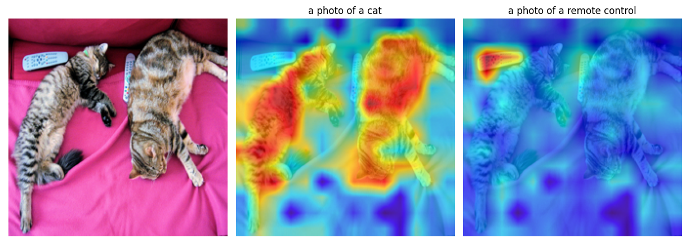
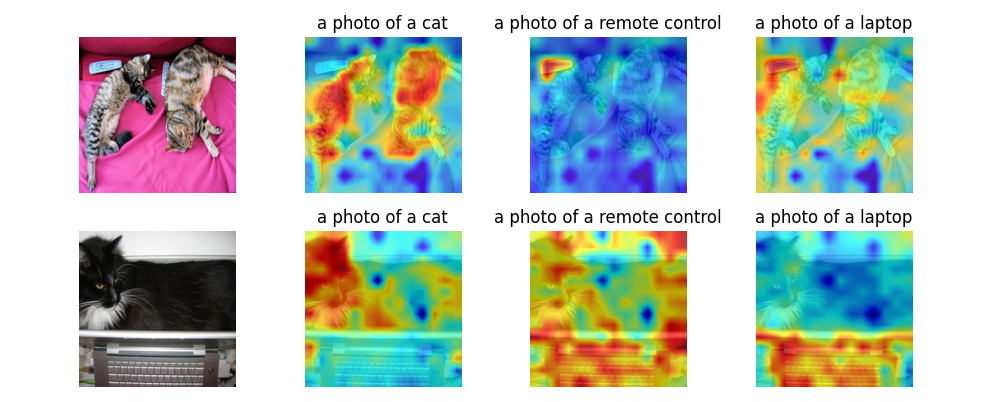
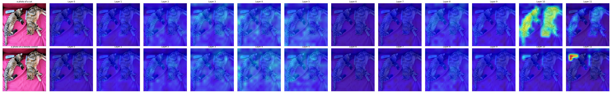

# LeGrad
This is a project reproducting [LeGrad](https://github.com/WalBouss/LeGrad) to support **batch** computation.

- [Example](#example)
- [Layer-wise view](#layer-wise-view)
- [Reference](#reference)


## Example

|   File   |   Result   |
| :--: | :--: |
|   [openclip_cat_remote.py](./examples/openclip_cat_remote.py)   |      |
|   [openclip_coco_batch.py](./examples/openclip_coco_batch.py)   |      |

## Layer-wise view

|   [openclip_cat_remote.py](./examples/openclip_cat_remote.py)   |
| :--: |
|      |

|   [openclip_coco_batch.py](./examples/openclip_coco_batch.py)   |
| :--: |
|      |


## Reference
```
@article{bousselham2024legrad,
  author    = {Bousselham, Walid and Boggust, Angie and Chaybouti, Sofian and Strobelt, Hendrik and Kuehne, Hilde}
  title     = {LeGrad: An Explainability Method for Vision Transformers via Feature Formation Sensitivity},
  journal   = {arXiv preprint arXiv:2404.03214},
  year      = {2024},
}
```
